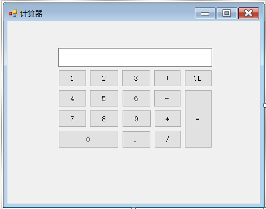
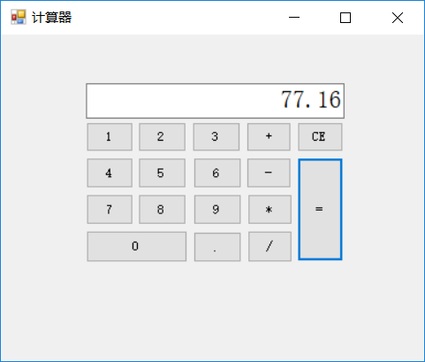

# **（一）卢沁书的demo——带数字按钮的计算器**
## 一、**项目简介**
        这是一款可以在电脑上通过鼠标点击相应数字与运算符按钮，从而得到计算结果的简易计算器，方便了人们在电脑上的相关计算工作。该计算器有加、减、乘、除四种计算功能，且能够输入小数进行运算，具有清零的功能。

---
## 二、**设计流程**
1. 安装visual studio 2017，上网查阅相关资料，读懂相关程序。
2. 打开visual studio 2017，新建项目，选择windows窗体应用。
3. 打开工具箱，将所需的按钮一一拖入form1中，并修改属性，得到显示数字和运算符的按钮，使前面板呈现出计算器的模样。

4. 将文本框拖入form1中，属性设置为只读，用于显示按钮输入的数字以及最终计算的结果。
5. 将每个按钮分别双击开来，进入编程界面，将每个按钮的函数一一编写出代码，实现其逻辑功能。
6. 运行程序，检查有无错误。
7. 优化功能。

---
## 三、**程序代码**
### 1、编写函数，在文本框中增加用户输入的数字
```C
private void addNum(int num)
{
    textBox1.Text = textBox1.Text + num.ToString();
    if(textBox1.Text.Length>=2)
    {
        if (textBox1.Text.Substring(0, 1) == "0" && textBox1.Text.Substring(1, 1) != ".")
            textBox1.Text = textBox1.Text.Substring(1);
    }
}
```
将输入的数字转化成字符串形式，并加到文本框中。
### 2、编写0~9按钮
```C
private void button1_Click(object sender, EventArgs e)
{
    addNum(1);
}
private void button2_Click(object sender, EventArgs e)
{
    addNum(2);
}
```
以上仅以1、2数字按钮为例，调用addNum函数，将相应数字加入到文本框中。
### 3、编写四则运算符按钮
```C
double temp1 = -1;
double temp2 = -1;
int pos = 0;
private void button12_Click(object sender, EventArgs e)
{
    pos = 1;
    temp1 = Convert.ToDouble(textBox1.Text);
    textBox1.Text = "";
}
```
先设置两个double类型的数据，用以存储运算符输入前后的数据。再设置一个整型变量pos，用于标识是哪个运算符。以+运算符为例，将其pos设置为1，将运算符之前输入到文本框的内容转化为double数据存入temp1中，再使文本框清零。
### 4、编写=按钮
```C
private void button17_Click(object sender, EventArgs e)
{
    temp2 = Convert.ToDouble(textBox1.Text);
    switch (pos)
    {
        case 1:
            textBox1.Text = (temp1 + temp2).ToString();
            break;
        case 2:
            textBox1.Text = (temp1 - temp2).ToString();
            break;
        case 3:
            textBox1.Text = (temp1 * temp2).ToString();
            break;
        case 4:
            textBox1.Text = (temp1 / temp2).ToString();
            break;
    }
}
```
将运算符之后输入的内容转化为double型数据存入temp2中，通过switch语句识别出相应的运算符，并进行相应的计算，将结果转化为字符串型数据，显示到文本框中。
### 5、编写清零按钮
```C
private void button16_Click(object sender, EventArgs e)
{
    textBox1.Text = "";
    pos = 0;
    temp1 = 0;
}
```
将文本框清零，并且将temp1和pos也清零。
### 6、编写小数点按钮
```C
private void button11_Click(object sender, EventArgs e)
{
    if (textBox1.Text == "")
        textBox1.Text = "0.";
    else if (textBox1.Text.IndexOf(".") >= 0)
        MessageBox.Show("已经添加了小数点！","提示");
    else
        textBox1.Text = textBox1.Text + ".";
}
```
小数点前没有数字时默认为"0."，如果输入超过1个小数点，打开提示报错窗口，将小数点加入到文本框中。

---
## 四、**项目测试**
运行程序，用按钮输入整数或小数，进行四则运算，可以得到正确结果；点击清零按钮CE，文本框清零成功；输入两个小数点，提示窗口成功出现。整个计算器的功能成功实现。


---
## 五、**后期改进**
目前计算器还没有连加连乘功能，也没有括号功能，之后的优化中，可以加入这些功能，完美满足用户需求。

---
## 六、**项目使用**
通过点击按键上的按钮，输入所需计算的数，再点击运算符按钮，进行所需的运算，通过点击=按钮，得到计算结果。点击CE按钮，可以实现清零的功能。

---
## 七、**项目的作者**
该项目由华中科技大学电气与电子工程学院气卓1601班的**卢沁书**制作完成。


# **（二）黄博的demo——文件管理器**

## 目录

### 1.文件管理器介绍


### 2.Demo测试

### 3.使用说明

#### 3.1 查看文件（夹）大

#### 3.2 复制文件

#### 3.3 删除文件（夹）

#### 3.4 查看文件目录

### 4.项目贡献者及作者

### 附录 代码

---
## 1.文件管理器介绍
       这是我在学完Java后使用学过的语法制作的一个简单的文件管理相关的demo，该demo多涉及到iostream和file的知识，对类的继承和引用运用不多。
       该文件管理器在命令行里运行，成功实现了查看指定文件（夹）大小、复制文件、删除文件和查看文件目录的功能。

---

## 2.Demo测试

       打开cmd,在文件路径下执行命令。
```
java governmor      

```
       会出现以下文字，若 3 中的使用说明可以正常使用，则测试成功。


---

## 3.使用说明

        接下来分别对文件管理器的四个功能：查看指定文件（夹）大小、复制（文件）、删除文件和查看文件目录进行介绍。

### 3.1 查看文件（夹）大小

       打开demo后按照说明输入 1 并按下回车，进行下一步；
       按照提示输入文件路径，如果输入错误，会提示输入路径不存在或输入为文件名并重新输入；
       最后会输出文件的字节大小数。


### 3.2 复制文件
    
       输入 2 按下回车，输入原文件的文件路径，接着输入文件复制的目标位置进行复制，
     
       
       最后目标文件路径下会出现copy-文件名的文件夹


**！！注意该功能由于使用了递归，不可以复制到文件本身的路径**

### 3.3 删除文件（夹）

       输入 3 并按回车，输入指定文件路径，会对文件进行删除


### 3.4 查看文件目录

       输入 4 并按回车，输入指定文件路径，会按照文件夹的级层列出文件内容，如下目录中有一个文本文档和一个MP3文档，输入后会得到


## 4.项目贡献值及作者

       作 者  ：黄博 
       GitHub ：Ssssplendid

## 附录 demo代码

```
package Demo_asd;

import java.io.BufferedInputStream;
import java.io.BufferedOutputStream;
import java.io.File;
import java.io.FileInputStream;
import java.io.FileOutputStream;
import java.io.IOException;
import java.util.Scanner;

public class Demo_Governer {
	public static void main(String[] args) throws IOException {
		System.out.println("欢迎使用文件管理器，您可以进行一下操作 ：");
		
		while(true) {

			System.out.println("---------------------------------");
			System.out.println("1.查看文件大小");
			System.out.println("2.复制文件");
			System.out.println("3.删除文件");
			System.out.println("4.查看文件目录");
			System.out.println("---------------------------------");
			System.out.println("请输入数字1-4进行上述操作");
			Scanner sc = new Scanner(System.in);
			int i = sc.nextInt();
		
			switch (i) {
				case 1:
					
					System.out.println("请输入文件夹路径");
					File dir = getDir();
					System.out.println("文件大小为 " + getDirLength(dir) + "字节");
					break;
					
				case 2:
					
					System.out.println("请输入原文件路径");
					File dir1 = getDir();
					System.out.println("请输入目标文件路径");
					File dir2 = getDir();
					copyFiles(dir1,dir2);
					break;
					
				case 3:
					
					System.out.println("请输入文件夹路径");
					File dir3 = getDir();
					deleteFiles(dir3);
					break;
					
				case 4:

					System.out.println("请输入文件夹路径");
					File dir4 = getDir();
					printLev(dir4 , 0);
					
					break;
					
				default:
					System.out.println("您输入有误，请重新输入数字1-4");
					break;
			}
		}
	}
	
	public static File getDir() {
		Scanner sc = new Scanner(System.in);
		String line = sc.nextLine();
		
		while(true) {
			File dir = new File(line);
			if(!dir.exists()) {
				System.out.println("该路径不存在，请重新输入：");
				getDir();
			}else if(!dir.isDirectory()) {
				System.out.println("该路径是一个文件，请重新输入：");
				getDir();
			}else {
				return dir;
			}
		}
	}
	
	public static long getDirLength(File dir) {
		long length = 0;
		File [] subfiles = dir.listFiles();
		
		for (File file : subfiles) {
			if(file.isDirectory()) {
				length = length + getDirLength(file);
			}else {
				length = length + file.length();
			}
		}
		
		return length;
	}
	
	public static void copyFiles(File dir1, File dir2) throws IOException {
		File dir = new File(dir2 , "Copy-" + dir1.getName());
		dir.mkdir();
		
		File [] subfile = dir1.listFiles();
		for (File file : subfile) {
			if(file.isFile()) {
				BufferedInputStream bis = new BufferedInputStream(new FileInputStream(file));
				BufferedOutputStream bos = 
						new BufferedOutputStream(new FileOutputStream(new File(dir , file.getName())));
				int b ;
				while((b = bis.read()) != -1) {
					bos.write(b);
				}
				bis.close();
				bos.close();
			}else {
				copyFiles(file, dir);
			}
		}
		System.out.println("复制完成");
	}
	
	public static void deleteFiles(File dir) {
		File [] SubFiles = dir.listFiles();
		for (File file : SubFiles) {
			if(file.isDirectory()) {
				deleteFiles(file);
			}else {
				file.delete();
			}
		}
		dir.delete();
		System.out.println("已删除");
	}

	public static void printLev(File dir , int level) {
		File [] subfile = dir.listFiles();
		for (File file : subfile) {
			for(int i = 0 ; i <= level ; i++) {
				System.out.print("\t");
			}
			System.out.println(file);
			if(file.isDirectory()) {
				printLev(file ,level + 1);
			}
		}
	}
	
}

```


# **（三）陈岑的demo——打飞机小游戏**
## **变量定义**
---
```C++
#include<stdio.h>
#include<string.h>
#include<conio.h>
#include<windows.h>
#include<stdlib.h>
#define MAX 100
long long int speed = 0;//控制敌机的速度 
int position_x, position_y;//飞机的所在位置 
int high, width;//地图的大小 
int bullet_x, bullet_y;//子弹的位置 
int enemy_x, enemy_y;//敌人的位置 
int map[MAX][MAX];
/*0表示空白，1表示战机*的区域，2表示敌人战机的位置。
3表示上下围墙，4表示左右围墙,5表示子弹的位置*/
int score;//分数
```
## **函数定义**
---
### 初始化所有信息
```C++
void starup()
{
	high = 20;
	width = 30;
	position_x = high / 2;
	position_y = width / 2;
	bullet_x = 0;
	bullet_y = position_y;
	enemy_x = 2;
	enemy_y = position_y - 1;
	score = 0;

}
```
### 初始化地图
```C++
void startMap()
{       //左右围墙的初始化以及空白区域的初始化
	int i, j;
	for (i = 1; i <= high - 1; i++)
	{
		map[i][1] = 4;
		for (j = 2; j <= width - 1; j++)
			map[i][j] = 0;
		map[i][width] = 4;
	}
	//下方围墙的初始化 
	i = high;
	for (j = 1; j <= width; j++)
		map[i][j] = 3;

	map[bullet_x][bullet_y] = 5;
	/*初始化战机大小*/
	map[position_x - 1][position_y] = 1;
	i = position_x;
	for (j = position_y - 2; j <= position_y + 2; j++)
		map[i][j] = 1;
	map[position_x + 1][position_y - 1] = 1;
	map[position_x + 1][position_y + 1] = 1;
	/***      初始化结束         **/

	/* 初始化敌机大小 */
	map[enemy_x][enemy_y] = 2;
	map[enemy_x - 1][enemy_y - 1] = 2;
	map[enemy_x - 1][enemy_y + 1] = 2;
	/***      初始化结束         **/
} 
```
### 隐藏光标
```C++
void HideCursor()
{
	CONSOLE_CURSOR_INFO cursor_info = { 1, 0 };
	SetConsoleCursorInfo(GetStdHandle(STD_OUTPUT_HANDLE), &cursor_info);
}
```
### 清理多余的屏幕
```C++
void gotoxy(int x, int y)
{
	HANDLE handle = GetStdHandle(STD_OUTPUT_HANDLE);
	COORD pos;
	pos.X = x;
	pos.Y = y;
	SetConsoleCursorPosition(handle, pos);
}
```
### 与输入无关的更新
```C++
void updateWithoutInput() 
{
	if (bullet_x > 0)
		bullet_x--;   //实现子弹的移动
	if ((bullet_x == enemy_x) && (bullet_y == enemy_y))//当敌机被击中时 
	{
		score++;
		enemy_x = 0;
		enemy_y = rand() % width;
		bullet_x = 0;
	}
	if (enemy_x > high)//当敌机超出区域 
	{
		enemy_x = 0;
		enemy_y = rand() % width;
	}
	if (speed == 1)
		for (int i = 1; i <= 10000; i++)//用来控制敌机的速度 
		{
			for (int j = 1; j <= 10000; j++)
			{
				speed = 1;
			}
		}
	speed = 0;
	if (speed == 0)
	{
		enemy_x++;
		speed = 1;
	}
}
```
### 与输入有关的更新
```C++
void updateWithInput()
{
	char input;
	if (_kbhit())  //判断有无输入
	{
		input = _getch();   //不需要回车的连续输入
		if (input == 'a')
			position_y--;
		if (input == 's')
			position_x++;
		if (input == 'd')
			position_y++;
		if (input == 'w')
			position_x--;
		if (input == ' ')
		{
			bullet_x = position_x - 1;
			bullet_y = position_y;
		}
	}
}
```
### 界面显示及操作说明
```C++
void show()
{
	gotoxy(0, 0);
	int i, j;
	for (i = 1; i <= high; i++)
	{
		for (j = 1; j <= width; j++)
		{
			if (map[i][j] == 0)
				printf(" ");
			if (map[i][j] == 1)
				printf("*");
			if (map[i][j] == 2)
				printf("#");
			if (map[i][j] == 3)
				printf("~");
			if (map[i][j] == 4)
				printf("|");
			if (map[i][j] == 5)
				printf("|");
		}
		printf("\n");
	}
	printf("\n你的得分:%d\n\n", score);
	printf("操作说明: ASDW分别操作 左下右上四个的移动\n");
	printf("**空格是发出子弹**\n");
}
```
## **主函数运行**
---
```C++
int main()
{
	starup();
	while (1)
	{
		HideCursor();
		startMap();
		show();
		updateWithoutInput();
		updateWithInput();
	}
	return 0;
}
```
## **游戏界面显示**
---

