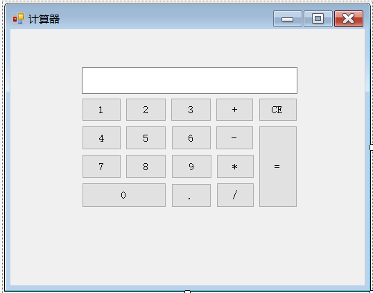
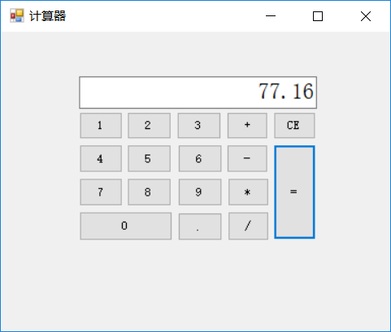

# **卢沁书的demo——带数字按钮的计算器**
## 一、**项目简介**
        这是一款可以在电脑上通过鼠标点击相应数字与运算符按钮，从而得到计算结果的简易计算器，方便了人们在电脑上的相关计算工作。该计算器有加、减、乘、除四种计算功能，且能够输入小数进行运算，具有清零的功能。

---
## 二、**设计流程**
1. 安装visual studio 2017，上网查阅相关资料，读懂相关程序。
2. 打开visual studio 2017，新建项目，选择windows窗体应用。
3. 打开工具箱，将所需的按钮一一拖入form1中，并修改属性，得到显示数字和运算符的按钮，使前面板呈现出计算器的模样。

4. 将文本框拖入form1中，属性设置为只读，用于显示按钮输入的数字以及最终计算的结果。
5. 将每个按钮分别双击开来，进入编程界面，将每个按钮的函数一一编写出代码，实现其逻辑功能。
6. 运行程序，检查有无错误。
7. 优化功能。

---
## 三、**程序代码**
### 1、编写函数，在文本框中增加用户输入的数字
```C
private void addNum(int num)
{
    textBox1.Text = textBox1.Text + num.ToString();
    if(textBox1.Text.Length>=2)
    {
        if (textBox1.Text.Substring(0, 1) == "0" && textBox1.Text.Substring(1, 1) != ".")
            textBox1.Text = textBox1.Text.Substring(1);
    }
}
```
将输入的数字转化成字符串形式，并加到文本框中。
### 2、编写0~9按钮
```C
private void button1_Click(object sender, EventArgs e)
{
    addNum(1);
}
private void button2_Click(object sender, EventArgs e)
{
    addNum(2);
}
```
以上仅以1、2数字按钮为例，调用addNum函数，将相应数字加入到文本框中。
### 3、编写四则运算符按钮
```C
double temp1 = -1;
double temp2 = -1;
int pos = 0;
private void button12_Click(object sender, EventArgs e)
{
    pos = 1;
    temp1 = Convert.ToDouble(textBox1.Text);
    textBox1.Text = "";
}
```
先设置两个double类型的数据，用以存储运算符输入前后的数据。再设置一个整型变量pos，用于标识是哪个运算符。以+运算符为例，将其pos设置为1，将运算符之前输入到文本框的内容转化为double数据存入temp1中，再使文本框清零。
### 4、编写=按钮
```C
private void button17_Click(object sender, EventArgs e)
{
    temp2 = Convert.ToDouble(textBox1.Text);
    switch (pos)
    {
        case 1:
            textBox1.Text = (temp1 + temp2).ToString();
            break;
        case 2:
            textBox1.Text = (temp1 - temp2).ToString();
            break;
        case 3:
            textBox1.Text = (temp1 * temp2).ToString();
            break;
        case 4:
            textBox1.Text = (temp1 / temp2).ToString();
            break;
    }
}
```
将运算符之后输入的内容转化为double型数据存入temp2中，通过switch语句识别出相应的运算符，并进行相应的计算，将结果转化为字符串型数据，显示到文本框中。
### 5、编写清零按钮
```C
private void button16_Click(object sender, EventArgs e)
{
    textBox1.Text = "";
    pos = 0;
    temp1 = 0;
}
```
将文本框清零，并且将temp1和pos也清零。
### 6、编写小数点按钮
```C
private void button11_Click(object sender, EventArgs e)
{
    if (textBox1.Text == "")
        textBox1.Text = "0.";
    else if (textBox1.Text.IndexOf(".") >= 0)
        MessageBox.Show("已经添加了小数点！","提示");
    else
        textBox1.Text = textBox1.Text + ".";
}
```
小数点前没有数字时默认为"0."，如果输入超过1个小数点，打开提示报错窗口，将小数点加入到文本框中。

---
## 四、**项目测试**
运行程序，用按钮输入整数或小数，进行四则运算，可以得到正确结果；点击清零按钮CE，文本框清零成功；输入两个小数点，提示窗口成功出现。整个计算器的功能成功实现。


---
## 五、**后期改进**
目前计算器还没有连加连乘功能，也没有括号功能，之后的优化中，可以加入这些功能，完美满足用户需求。

---
## 六、**项目使用**
通过点击按键上的按钮，输入所需计算的数，再点击运算符按钮，进行所需的运算，通过点击=按钮，得到计算结果。点击CE按钮，可以实现清零的功能。

---
## 七、**项目的作者**
该项目由华中科技大学电气与电子工程学院气卓1601班的**卢沁书**制作完成。